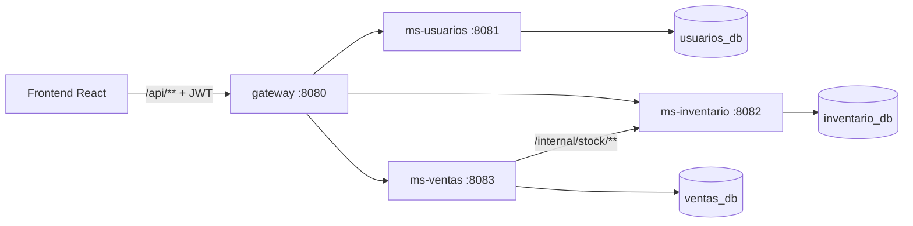

# Arquitectura – InventarioWeb

_29/09/2026 · basada en ERS revisión 1.1_

## 1. Visión general



- Una instancia MySQL 8, un schema por servicio. Ningún servicio lee el schema de otro.
- Esquema versionado con **Flyway** en cada servicio (`src/main/resources/db/migration/V1__init.sql`), `spring.jpa.hibernate.ddl-auto=validate`.
- **Zona horaria**: todas las fechas son `LocalDateTime` en America/Santiago, asignadas por la aplicación con un `Clock` en esa zona (inyectable en tests). No se depende de `CURRENT_TIMESTAMP` ni de la zona del servidor MySQL. Los rangos `desde`/`hasta` de filtros y reportes son fechas (`LocalDate`) en esa misma zona.
- JWT HS256 firmado por ms-usuarios (`JWT_SECRET` por variable de entorno). Los demás lo validan localmente con `spring-boot-starter-oauth2-resource-server`. Claims: `sub` (id), `nombre`, `rol`. Cada servicio verifica el rol por endpoint (columna "Rol" de las tablas) y el frontend oculta lo que el rol no puede usar (RF-03).
- `gateway` (Spring Cloud Gateway): ruteo y CORS, sin BD. **No rutea `/internal/**`**.
- Única dependencia entre servicios: ms-ventas → ms-inventario, y solo cuando la venta tiene productos registrados.
- Estructura: `backend/gateway`, `backend/ms-usuarios`, `backend/ms-inventario`, `backend/ms-ventas`; cada uno proyecto Maven independiente, capas controller/service/repository (RNF-15), Swagger con springdoc (RNF-18).

### Por qué 3 y no 4
Las estadísticas de un cliente salen de las líneas de venta y el historial de ventas muestra nombres de clientes. Separar clientes de ventas obliga a llamadas en ambos sentidos; juntos, son un JOIN.

## 2. Microservicios

### 2.1 ms-usuarios — autenticación y usuarios (RF-01 a RF-05)
Entidades: `Usuario`.

| Método | Endpoint | Rol | RF |
|---|---|---|---|
| POST | /api/auth/login | público | RF-01 |
| GET | /api/usuarios | Admin | RF-04 |
| POST | /api/usuarios | Admin | RF-04 |
| PUT | /api/usuarios/{id} | Admin | RF-04 |
| PATCH | /api/usuarios/{id}/desactivar | Admin | RF-04 |
| PUT | /api/usuarios/me/password | Ambos | RF-05 |

RF-02 es solo frontend (descarta el token). Login con error genérico; usuario inactivo no entra.

### 2.2 ms-inventario — productos registrados, categorías y stock (RF-06 a RF-14)
Entidades: `Categoria`, `Producto`, `MovimientoStock`.

| Método | Endpoint | Rol | RF |
|---|---|---|---|
| GET | /api/categorias | Ambos | RF-10 |
| POST / PUT | /api/categorias, /api/categorias/{id} | Admin | RF-10 |
| PATCH | /api/categorias/{id}/desactivar | Admin | RF-10 (falla si tiene productos activos) |
| GET | /api/productos?q=&categoriaId=&page= | Ambos | RF-09 |
| GET | /api/productos/{id} | Ambos | RF-09 |
| POST | /api/productos | Admin | RF-06 |
| PUT | /api/productos/{id} | Admin | RF-07 (no toca stock) |
| PATCH | /api/productos/{id}/desactivar | Admin | RF-08 |
| POST | /api/stock/entradas | Admin | RF-11 |
| POST | /api/stock/salidas | Admin | RF-12 |
| POST | /api/stock/ajustes | Admin | RF-13 |
| GET | /api/stock/movimientos?productoId=&tipo=&desde=&hasta=&page= | Ambos | RF-14 |
| POST | /internal/stock/ventas/{ventaId} | servicio | RF-15 |
| POST | /internal/stock/ventas/{ventaId}/anulacion | servicio | RF-18 |

`/internal/stock/ventas/{ventaId}` recibe `[{productoId, cantidad}]` (agregado por producto) y, en una sola transacción:
- por cada producto: `UPDATE producto SET stock = stock - :c WHERE id = :id AND activo AND stock >= :c`; si afecta 0 filas → rollback total y **409** `{productoId, nombre, stockDisponible}`;
- inserta un movimiento `VENTA` por producto;
- responde el snapshot `[{productoId, sku, nombre, precioVenta, precioCosto}]`.

El UPDATE condicional cumple RNF-11 sin locks explícitos.

`/anulacion` no recibe body: devuelve las cantidades de los movimientos `VENTA` de esa venta y crea movimientos `ANULACION`. Si ya existen, responde 200 sin hacer nada. Ambos endpoints son idempotentes por `UNIQUE (venta_id, producto_id, tipo)`.

### 2.3 ms-ventas — clientes, ventas y reportes (RF-15 a RF-27)
Entidades: `Cliente`, `Venta`, `VentaLinea`, `Configuracion`.

**Clientes**

| Método | Endpoint | Rol | RF |
|---|---|---|---|
| GET | /api/clientes?q=&page= (incluye totalGastado y ultimaCompra) | Ambos | RF-24 |
| GET | /api/clientes/duplicados?telefono=&usuarioRedes= | Ambos | RF-22 (aviso) |
| POST | /api/clientes | Ambos | RF-22 |
| PUT | /api/clientes/{id} | Ambos | RF-23 |
| PATCH | /api/clientes/{id}/desactivar | Admin | RF-23 |
| POST | /api/clientes/{id}/anonimizar | Admin | Ley 19.628 (3.4) |
| GET | /api/clientes/{id} (ficha: datos, historial, total, nº compras, ticket promedio, última compra) | Ambos | RF-25 |
| GET | /api/clientes/ranking?orden=total\|compras&desde=&hasta= | Ambos | RF-26 |
| GET | /api/clientes/inactivos | Ambos | RF-27 |
| GET / PUT | /api/configuracion/dias-inactivo | Ambos / Admin | RF-27 |

**Ventas**

| Método | Endpoint | Rol | RF |
|---|---|---|---|
| POST | /api/ventas | Ambos | RF-15 |
| GET | /api/ventas?desde=&hasta=&canal=&clienteId=&estado=&page= | Ambos | RF-16 |
| GET | /api/ventas/{id} | Ambos | RF-17 |
| POST | /api/ventas/{id}/anular `{motivo}` | Admin | RF-18 |

Cada línea del `POST /api/ventas` trae `{productoId, cantidad, clienteId?}` (producto registrado; el precio lo pone inventario) o `{descripcion, precioUnitario, cantidad, clienteId?}` (ítem libre).

**Reportes**

| Método | Endpoint | Rol | RF |
|---|---|---|---|
| GET | /api/reportes/ventas?desde=&hasta=&canal= | Ambos | RF-19 |
| GET | /api/reportes/productos-mas-vendidos?desde=&hasta=&limite= | Ambos | RF-20 |
| GET | /api/reportes/dashboard | Ambos | RF-21 |

Estadísticas y reportes consideran solo ventas `VIGENTE`. Por cliente suman todas sus líneas (registradas y libres). Costo y ganancia (RF-19) solo sobre líneas con `costo_unitario`; más vendidos (RF-20) solo líneas con `producto_id`.

**Flujo RF-15 (registrar venta)** — `@Transactional` en ms-ventas:
1. Valida: ≥1 línea, cantidad > 0; ítem libre con descripción y precio > 0; clientes existen y están activos; 0 clientes → anónima; 1 → se asigna a todas las líneas; ≥2 → toda línea trae `clienteId` de la venta.
2. `INSERT venta` (VIGENTE) → id.
3. Si hay líneas con `productoId`: llama `/internal/stock/ventas/{id}` con esas líneas agregadas por producto. 409 → excepción → rollback, se informa producto y stock. **Si no hay ninguna, no se llama a inventario.**
4. `INSERT venta_linea`: registradas con el snapshot (sku, nombre → descripcion, precio, costo); libres con descripción y precio ingresados. Calcula total.
5. Commit. Si algo falla después de iniciar el paso 3 (timeout incluido) → se llama `/anulacion` como compensación (idempotente).
   `ponytail:` si la compensación también falla, queda en log para corrección manual; outbox si llega a pasar en la práctica.

**Flujo RF-18 (anular)** — `@Transactional` en ms-ventas:
1. `SELECT … FOR UPDATE` de la venta; si no es VIGENTE → 409.
2. Si tiene líneas con `producto_id`: llama `/internal/stock/ventas/{id}/anulacion`. Si falla → excepción, rollback, la venta sigue VIGENTE y el stock no cambió; el usuario ve el error y puede reintentar.
3. Marca ANULADA con motivo, usuario y fecha. Commit.
4. **Caso de falla:** si el commit local falla después de que inventario devolvió el stock, queda stock devuelto con la venta aún VIGENTE. Se registra en log con el id de la venta y el usuario recibe error; al reintentar la anulación, inventario responde 200 sin duplicar movimientos (idempotente) y la venta queda ANULADA.
   `ponytail:` la ventana de inconsistencia depende de que alguien reintente; job de reconciliación si pasa en la práctica.

## 3. Modelo de datos MySQL

Montos en `INT` (CLP sin decimales). Fechas `DATETIME` asignadas por la aplicación (America/Santiago). Bajas lógicas con `activo`. Claves foráneas declaradas **a nivel de tabla** (MySQL ignora `REFERENCES` en la definición de columna). Referencias a otro schema (`producto_id`, `venta_id`, `usuario_id`) no llevan FK.

### 3.1 usuarios_db
```sql
CREATE TABLE usuario (
  id            BIGINT PRIMARY KEY AUTO_INCREMENT,
  nombre        VARCHAR(100) NOT NULL,
  correo        VARCHAR(150) NOT NULL UNIQUE,
  password_hash VARCHAR(100) NOT NULL,          -- BCrypt (RNF-05)
  rol           ENUM('ADMIN','VENDEDOR') NOT NULL,
  activo        BOOLEAN NOT NULL DEFAULT TRUE,
  creado_en     DATETIME NOT NULL
);
```

### 3.2 inventario_db
```sql
CREATE TABLE categoria (
  id     BIGINT PRIMARY KEY AUTO_INCREMENT,
  nombre VARCHAR(60) NOT NULL UNIQUE,
  activa BOOLEAN NOT NULL DEFAULT TRUE
);

CREATE TABLE producto (
  id           BIGINT PRIMARY KEY AUTO_INCREMENT,
  sku          VARCHAR(40) NOT NULL UNIQUE,
  nombre       VARCHAR(120) NOT NULL,
  categoria_id BIGINT NOT NULL,
  precio_venta INT NOT NULL,
  precio_costo INT NOT NULL,
  stock        INT NOT NULL,
  descripcion  VARCHAR(500),
  activo       BOOLEAN NOT NULL DEFAULT TRUE,
  FOREIGN KEY (categoria_id) REFERENCES categoria(id),
  CHECK (precio_venta > 0),
  CHECK (precio_costo > 0),
  CHECK (stock >= 0),                            -- respaldo de RNF-11
  INDEX (nombre)
);

CREATE TABLE movimiento_stock (
  id               BIGINT PRIMARY KEY AUTO_INCREMENT,
  producto_id      BIGINT NOT NULL,
  tipo             ENUM('ENTRADA','SALIDA','AJUSTE','VENTA','ANULACION') NOT NULL,
  cantidad         INT NOT NULL,                 -- delta con signo
  stock_resultante INT NOT NULL,
  motivo           VARCHAR(200),
  venta_id         BIGINT NULL,                  -- id en ventas_db
  usuario_id       BIGINT NOT NULL,              -- id en usuarios_db
  usuario_nombre   VARCHAR(100) NOT NULL,
  fecha            DATETIME NOT NULL,
  FOREIGN KEY (producto_id) REFERENCES producto(id),
  UNIQUE (venta_id, producto_id, tipo),          -- idempotencia
  INDEX (producto_id, fecha)
);
```
Movimientos: solo INSERT (nunca UPDATE/DELETE).

### 3.3 ventas_db
```sql
CREATE TABLE cliente (
  id            BIGINT PRIMARY KEY AUTO_INCREMENT,
  nombre        VARCHAR(100) NOT NULL,
  telefono      VARCHAR(20),
  usuario_redes VARCHAR(60),                     -- @instagram o @tiktok
  direccion     VARCHAR(200),
  activo        BOOLEAN NOT NULL DEFAULT TRUE,
  anonimizado   BOOLEAN NOT NULL DEFAULT FALSE,
  creado_en     DATETIME NOT NULL,
  CHECK (anonimizado OR telefono IS NOT NULL OR usuario_redes IS NOT NULL),
  INDEX (telefono), INDEX (usuario_redes), INDEX (nombre)
);

CREATE TABLE venta (
  id                 BIGINT PRIMARY KEY AUTO_INCREMENT,
  fecha              DATETIME NOT NULL,
  canal              ENUM('LOCAL','REDES') NOT NULL,
  estado             ENUM('VIGENTE','ANULADA') NOT NULL DEFAULT 'VIGENTE',
  total              INT NOT NULL,
  direccion_despacho VARCHAR(200),
  usuario_id         BIGINT NOT NULL,
  usuario_nombre     VARCHAR(100) NOT NULL,
  motivo_anulacion   VARCHAR(200),
  anulada_por_id     BIGINT,
  anulada_en         DATETIME,
  INDEX (fecha, estado)
);

CREATE TABLE venta_linea (
  id              BIGINT PRIMARY KEY AUTO_INCREMENT,
  venta_id        BIGINT NOT NULL,
  cliente_id      BIGINT NULL,                   -- NULL = venta anónima
  producto_id     BIGINT NULL,                   -- NULL = ítem libre; id en inventario_db
  sku             VARCHAR(40) NULL,              -- snapshot, solo registrado
  descripcion     VARCHAR(200) NOT NULL,         -- snapshot del nombre o texto libre
  cantidad        INT NOT NULL,
  precio_unitario INT NOT NULL,                  -- snapshot o ingresado
  costo_unitario  INT NULL,                      -- snapshot, solo registrado
  FOREIGN KEY (venta_id) REFERENCES venta(id),
  FOREIGN KEY (cliente_id) REFERENCES cliente(id),
  CHECK (cantidad > 0),
  CHECK (precio_unitario > 0),
  CHECK ((producto_id IS NULL AND sku IS NULL AND costo_unitario IS NULL)
      OR (producto_id IS NOT NULL AND sku IS NOT NULL AND costo_unitario IS NOT NULL)),
  INDEX (cliente_id), INDEX (producto_id)
);

CREATE TABLE configuracion (
  clave VARCHAR(50) PRIMARY KEY,
  valor VARCHAR(100) NOT NULL
);  -- ('dias_inactivo', '60') insertado por Flyway
```
- No hay tabla venta_cliente: los clientes de una venta son los `cliente_id` distintos de sus líneas.
- El nombre del cliente **no** se copia a la venta, para que anonimizar (Ley 19.628) no deje datos personales en las ventas.
- Snapshots de producto y usuario sí se copian: reportes e historial no dependen de ms-inventario ni de ms-usuarios.

## 4. Plan de implementación

Regla: cada etapa termina con tests verdes (CLAUDE.md). Todo test nombra su RF, por ejemplo `@DisplayName("RF-15: rechaza venta sin stock")` / `it('RF-22: ...')`. Cada etapa incluye sus pantallas (Vitest para componentes, Playwright para el flujo del RF). Tests de BD contra MySQL real con Flyway (Testcontainers o el MySQL del docker-compose).

| Etapa | Alcance | RF | Pruebas clave |
|---|---|---|---|
| 0. Base | docker-compose con MySQL (3 schemas), esqueleto ms-ventas con Flyway y `Clock` America/Santiago, frontend Vite con layout del mockup, proxy de Vite | — | build y test vacío en verde |
| 1. Clientes | CRUD, búsqueda, duplicados, desactivar, anonimizar. Pantallas Clientes y formulario | RF-22, 23, 24 (sin estadísticas) | validación teléfono/redes, aviso duplicado, anonimizar conserva ventas |
| 2. Ventas con ítems libres | registrar, listar y detalle **solo con ítems libres**, sin ms-inventario. Pantalla Nueva venta (varios clientes) | RF-15, 16, 17 (parcial) | asignación por cliente, subtotal por cliente, validación de ítem libre, rechazo de líneas con `productoId` hasta etapa 4 |
| 3. Estadísticas y anulación | anular (solo cambio de estado); total gastado, ficha, ranking, inactivos, configuración de días | RF-18 (parcial), 24, 25, 26, 27 | anulada excluida de estadísticas, doble anulación → 409, venta compartida suma por cliente |
| 4. Inventario y productos registrados | ms-inventario completo + endpoints `/internal`; ms-ventas acepta líneas con `productoId`, descuenta y devuelve stock | RF-06 a 14, RF-15, 17, 18 (completos) | stock insuficiente, snapshot de precio/costo, venta mixta, venta sin productos no llama a inventario, concurrencia sobre el último stock (RNF-11), compensación (RNF-10), caso de falla de RF-18 |
| 5. Seguridad | ms-usuarios, login JWT, roles en los 3 servicios, gateway, pantallas Login y Usuarios | RF-01 a RF-05 (incluye RF-03), RNF-05 a 07 | login genérico, usuario inactivo, 403 por rol, `/internal` no expuesto |
| 6. Reportes | reporte de ventas, más vendidos, dashboard (Resumen) | RF-19, 20, 21 | ganancia solo con costo, total en ítems libres aparte, más vendidos sin ítems libres, excluye anuladas |
| 7. Cierre | cobertura ≥ 60% con JaCoCo, README, variables de entorno | RNF-16, 17, 20 | — |

Hasta la etapa 5 los servicios corren sin seguridad y `usuario_id`/`usuario_nombre` salen de un usuario fijo de desarrollo; en la etapa 5 se toman del JWT.

## 5. Diferencias con los mockups (manda el ERS)
No se incluyen en el modelo:
- Talla y color por prenda (ERS 1.2: sin variantes).
- Canales TikTok Live / Instagram (ERS: Local / Redes sociales).
- Medio de pago y "pago recibido" (ERS 2.6: futuro).
- Estados Pagado / Por despachar / Entregado y tarjeta "Despachos pendientes" (ERS 2.6: futuro).
- Costo de envío y comuna en el despacho (ERS: solo dirección).
- Tarjeta "Stock bajo" en Resumen (ERS 2.6: futuro).

Si alguna se aprueba, se agrega al ERS con su RF antes de implementarla.
