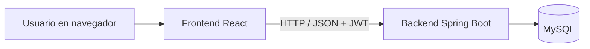

# ERS – Sistema de Gestión de Inventario (InventarioWeb)

_26/09/2026 · Maxi_

## Ficha del documento

**DUOC UC – Escuela de Informática y Telecomunicaciones** Especificación de Requisitos de Software según estándar IEEE 830. Proyecto: Sistema de Gestión de Inventario (Tienda de ropa) · Ramo: Desarrollo FullStack 2 · Revisión 1.0

| Fecha | Revisión | Autor | Modificación |
| :---- | :---- | :---- | :---- |
| 26/09/2026 | 1.0 | Maxi | Versión inicial: introducción, descripción general y requisitos |
| 29/09/2026 | 1.1 | Maxi | Productos opcionales en inventario: ventas con ítems libres (RF-15, RF-17, RF-18, RF-19, RF-20, RF-21) |

## 1. Introducción

El Sistema de Gestión de Inventario es una aplicación web para una tienda de ropa que vende en local físico y por redes sociales. Centraliza el control de stock, ventas y clientes (quién compra, qué compra y cuánto gasta), reemplazando el registro manual o disperso por un sistema único con reportes.

### 1.1. Propósito

Este documento especifica los requisitos funcionales y no funcionales del sistema. Está dirigido al equipo de desarrollo, al docente del ramo Desarrollo FullStack 2 y a la tienda, y sirve como base para el diseño, la implementación y las pruebas.

### 1.2. Ámbito del sistema

El sistema se denominará **"InventarioWeb"** (nombre provisorio).

Se compone de un frontend en React (capa de presentación) y un backend en Spring Boot que expone una API REST y persiste los datos en MySQL.

**Lo que el sistema hará:**

* Autenticar usuarios y controlar el acceso según rol (administrador y vendedor).
* Registrar los productos que la tienda decide llevar en inventario y sus categorías, para controlar su stock. No es obligatorio registrar todos los productos.
* Registrar entradas, salidas y ajustes de stock, con historial de movimientos.
* Gestionar la cartera de clientes: quién compra, qué compra, cuánto gasta y cuándo fue su última compra.
* Registrar ventas del local y de redes sociales, asociadas opcionalmente a uno o más clientes. Cada línea es un producto registrado (descuenta stock automáticamente) o un ítem libre ingresado a mano (no afecta stock).
* Anular ventas, devolviendo el stock correspondiente.
* Generar reportes de ventas y de clientes, y mostrar un dashboard con gráficos.

**Lo que el sistema no hará:**

* No se integrará con Instagram, TikTok ni otras redes sociales: las ventas online se ingresan manualmente.
* No procesará pagos ni emitirá boletas o facturas electrónicas (SII).
* No gestionará proveedores ni órdenes de compra.
* No manejará variantes de producto (talla, color): cada producto tiene un único stock.

**Beneficios y objetivos:** tener el stock real disponible en todo momento, evitar vender productos sin stock, conocer qué se vende y por qué canal, identificar a los mejores clientes y detectar a los que dejaron de comprar para volver a contactarlos.

### 1.3. Definiciones, acrónimos y abreviaturas

| Término | Definición |
| :---- | :---- |
| ERS | Especificación de Requisitos de Software. |
| API REST | Interfaz HTTP que el frontend usa para solicitar operaciones al backend. |
| SPA | Single Page Application: aplicación web que se renderiza dinámicamente en el navegador. |
| JWT | JSON Web Token: token firmado que identifica al usuario autenticado en cada petición. |
| CRUD | Crear, leer, actualizar y eliminar registros. |
| SKU | Código único que identifica a cada producto. |
| Movimiento de stock | Registro de cualquier cambio en la cantidad de un producto: entrada, salida, ajuste, venta o anulación. |
| Canal de venta | Medio por el que se concretó la venta: Local o Redes sociales. |
| Stock | Cantidad de unidades disponibles de un producto. |
| Producto registrado | Producto que la tienda decidió llevar en inventario: tiene SKU, precio de costo y stock controlado. |
| Ítem libre | Línea de venta ingresada a mano, con descripción y precio, sin SKU ni costo. No afecta stock. |
| Tienda | Negocio de ropa que encarga y usa el sistema (cliente del proyecto). |
| Cliente | Persona que compra en la tienda, registrada con sus datos de contacto. |
| Venta compartida | Venta con productos de más de un cliente que se paga o despacha en conjunto (ej: dos hermanas con envío a la misma dirección). Cada producto queda asignado al cliente que lo compró. |
| Cliente inactivo | Cliente con al menos una compra y sin compras en los últimos N días (60 por defecto). |

### 1.4. Referencias

* IEEE Std 830-1998, Recommended Practice for Software Requirements Specifications.
* Documentación oficial de React y Spring Boot.
* Material del ramo Desarrollo FullStack 2, Duoc UC.

### 1.5. Visión general del documento

La sección 2 describe el contexto del producto: funciones, usuarios, restricciones y supuestos. La sección 3 detalla los requisitos específicos: interfaces, requisitos funcionales numerados por módulo y requisitos no funcionales. Al final se listan los puntos pendientes por confirmar.

## 2. Descripción general

### 2.1. Perspectiva del producto

Es un producto independiente: no reemplaza ni se integra con otro software del cliente. Sigue una arquitectura cliente-servidor en tres capas: frontend React (navegador), backend Spring Boot (API REST) y base de datos MySQL. El frontend no accede directamente a la base de datos; toda la lógica de negocio vive en el backend.

### 2.2. Funciones del producto

| Módulo | Funciones principales |
| :---- | :---- |
| Autenticación y usuarios | Inicio y cierre de sesión, gestión de usuarios y roles. |
| Productos | Registro de productos y categorías, búsqueda y filtros. |
| Stock | Entradas, salidas y ajustes manuales; historial de movimientos. |
| Ventas | Registro de ventas con canal, clientes (uno, varios o ninguno), líneas de productos registrados o ítems libres y dirección de despacho; anulación con devolución de stock de los productos registrados. |
| Clientes | Registro de clientes, ficha con historial de compras y total gastado, ranking de mejores clientes y clientes inactivos. |
| Reportes y dashboard | Ventas por rango de fechas y canal, productos más vendidos, gráficos resumen. |

### 2.3. Características de los usuarios

Lo usarán entre 2 y 3 personas: el desarrollador durante la etapa de proyecto y 1-2 personas de la tienda. Existen dos perfiles:

| Rol | Descripción | Conocimientos requeridos |
| :---- | :---- | :---- |
| Administrador | Dueño o encargado. Acceso total: productos, stock, ventas, anulaciones, clientes, reportes y usuarios. | Uso básico de PC o celular y navegador web. |
| Vendedor | Atiende el local y las ventas por redes. Registra ventas y clientes; consulta productos, stock, costos, reportes e historial de clientes. | Uso básico de PC o celular y navegador web. |

### 2.4. Restricciones

* Frontend en React; backend en Java con Spring Boot; base de datos MySQL (exigencia del ramo y decisión del equipo).
* Comunicación entre capas mediante API REST con JSON sobre HTTP (HTTPS en producción).
* Arquitectura del backend (monolito o microservicios) sujeta a lo que exija el ramo.
* Plazo acotado al semestre académico.
* El sistema maneja datos comerciales de la tienda y datos personales de sus clientes, por lo que requiere autenticación obligatoria.

### 2.5. Suposiciones y dependencias

* La tienda cuenta con conexión a internet y un dispositivo con navegador moderno en el local.
* Las ventas por redes sociales las ingresa manualmente un usuario del sistema.
* Cada producto se vende como unidad sin variantes; si la tienda decide manejar tallas o colores, habrá que revisar el modelo de datos y varios requisitos.
* La tienda decide qué productos lleva en inventario; el resto se vende como ítem libre, sin control de stock ni cálculo de ganancia.
* Se asume un único local; múltiples sucursales quedan fuera de alcance.
* El despliegue en un servidor o nube queda sujeto a lo que defina el ramo y la tienda.

### 2.6. Requisitos futuros

* Alerta de stock bajo con umbral configurable por producto.
* Variantes de producto (talla y color) con stock independiente.
* Registro de medio de pago en cada venta y seguimiento del estado del despacho.
* Gestión de proveedores y compras.
* Exportación de reportes a Excel o PDF.
* Integración con catálogo de Instagram o TikTok Shop.

## 3. Requisitos específicos

Cada requisito tiene un código único (RF-XX funcional, RNF-XX no funcional) y una prioridad: **Esencial** (sin él el sistema no cumple su objetivo), **Deseable** (aporta valor, se implementa si hay tiempo) u **Opcional**.

### 3.1. Requisitos comunes de las interfaces

#### 3.1.1. Interfaces de usuario

* Aplicación web SPA con menú lateral (o superior en móvil) y un área de contenido.
* Menú visible según rol: el vendedor no ve la sección de gestión de usuarios.
* Pantallas principales: Inicio de sesión, Dashboard, Productos, Categorías, Stock / Movimientos, Nueva venta, Historial de ventas, Reportes y Usuarios.
* Diseño responsivo, usable en PC, tablet y celular.
* Mensajes de confirmación antes de acciones irreversibles (eliminar, anular venta) y mensajes de error claros en formularios.
* Montos en pesos chilenos (CLP), sin decimales, con separador de miles; fechas en formato dd/mm/aaaa.

#### 3.1.2. Interfaces de hardware

No requiere hardware especial. Funciona en PC, tablet o celular con navegador. Como mejora futura podría usarse un lector de código de barras que actúe como teclado para ingresar el SKU.

#### 3.1.3. Interfaces de software

| Producto | Propósito | Interfaz |
| :---- | :---- | :---- |
| Navegador web (Chrome, Edge, Firefox, Safari en versiones actuales) | Ejecutar el frontend React | HTML, CSS, JavaScript |
| Backend Spring Boot | Lógica de negocio y seguridad | API REST, JSON |
| MySQL 8 | Persistencia de datos | JDBC / JPA |

#### 3.1.4. Interfaces de comunicación

El frontend se comunica con el backend por HTTP (HTTPS en producción) mediante peticiones REST con cuerpo JSON. Cada petición a un recurso protegido incluye un token JWT en la cabecera Authorization.

### 3.2. Requisitos funcionales

Son 27 requisitos en seis módulos. Actores: **Admin** (administrador) y **Vendedor**; "Ambos" indica que los dos roles pueden ejecutarlo.

#### 3.2.1. Autenticación y usuarios

| ID | Requisito | Actor | Descripción | Prioridad |
| :---- | :---- | :---- | :---- | :---- |
| RF-01 | Iniciar sesión | Ambos | El usuario ingresa con correo y contraseña. Si los datos son incorrectos, el sistema muestra un mensaje genérico sin indicar cuál campo falló. Un usuario desactivado no puede ingresar. | Esencial |
| RF-02 | Cerrar sesión | Ambos | El usuario cierra su sesión y el token deja de usarse en el navegador. | Esencial |
| RF-03 | Controlar acceso por rol | Sistema | El sistema restringe pantallas y operaciones según el rol, tanto en el frontend como en el backend. | Esencial |
| RF-04 | Gestionar usuarios | Admin | Crear, editar y desactivar usuarios (nombre, correo único, rol, contraseña inicial). No se eliminan físicamente. | Esencial |
| RF-05 | Cambiar contraseña | Ambos | El usuario cambia su contraseña ingresando la actual y la nueva. | Deseable |

#### 3.2.2. Productos y categorías

| ID | Requisito | Actor | Descripción | Prioridad |
| :---- | :---- | :---- | :---- | :---- |
| RF-06 | Registrar producto | Admin | Datos: SKU (único), nombre, categoría, precio de venta, precio de costo, stock inicial y descripción opcional. Precios mayores a 0 y stock inicial mayor o igual a 0. | Esencial |
| RF-07 | Editar producto | Admin | Modifica los datos del producto, excepto el stock, que solo cambia mediante movimientos (RF-11 a RF-13). | Esencial |
| RF-08 | Desactivar producto | Admin | Baja lógica: el producto deja de aparecer para nuevas ventas pero se conserva en el historial. | Esencial |
| RF-09 | Listar y buscar productos | Ambos | Lista con SKU, nombre, categoría, precios y stock actual. Búsqueda por nombre o SKU y filtro por categoría. | Esencial |
| RF-10 | Gestionar categorías | Admin | Crear, editar y desactivar categorías (ej: poleras, pantalones, accesorios). No se puede desactivar una categoría con productos activos. | Esencial |

#### 3.2.3. Control de stock

| ID | Requisito | Actor | Descripción | Prioridad |
| :---- | :---- | :---- | :---- | :---- |
| RF-11 | Registrar entrada de stock | Admin | Suma unidades a un producto (cantidad mayor a 0) con un motivo, por ejemplo llegada de mercadería. | Esencial |
| RF-12 | Registrar salida manual | Admin | Resta unidades por motivos distintos a una venta (merma, pérdida, uso interno). No permite dejar el stock en negativo. | Esencial |
| RF-13 | Ajustar inventario | Admin | Tras un conteo físico, el usuario ingresa la cantidad real y el sistema registra la diferencia como ajuste. | Esencial |
| RF-14 | Consultar historial de movimientos | Ambos | Lista cada movimiento con fecha y hora, producto, tipo, cantidad, stock resultante, usuario y motivo. Filtros por producto, tipo y rango de fechas. | Esencial |

Todo cambio de stock, incluidas ventas y anulaciones, genera un movimiento. Los movimientos no se editan ni se eliminan.

#### 3.2.4. Ventas

| ID | Requisito | Actor | Descripción | Prioridad |
| :---- | :---- | :---- | :---- | :---- |
| RF-15 | Registrar venta | Ambos | Ver detalle abajo. | Esencial |
| RF-16 | Consultar historial de ventas | Ambos | Lista con número, fecha, canal, clientes, total, usuario y estado (Vigente / Anulada). Filtros por rango de fechas, canal, cliente y estado. | Esencial |
| RF-17 | Ver detalle de venta | Ambos | Muestra cada línea (producto registrado o ítem libre) con cantidad, precio unitario y cliente, el subtotal por cliente, el total y la dirección de despacho. | Esencial |
| RF-18 | Anular venta | Admin | Ver detalle abajo. | Esencial |

**RF-15 · Registrar venta**

1. El usuario selecciona el canal: Local o Redes sociales.
2. Agrega líneas de dos tipos: un producto activo, buscándolo por nombre o SKU, con su cantidad; o un ítem libre, ingresando descripción, precio unitario y cantidad.
3. Opcionalmente asocia uno o más clientes, buscándolos o creándolos en el momento sin salir de la venta.
4. Si hay más de un cliente, indica a cuál corresponde cada producto; el sistema muestra el subtotal por cliente y el total de la venta.
5. Opcionalmente ingresa una dirección de despacho, pudiendo usar la dirección registrada de uno de los clientes.
6. Al confirmar, el sistema valida que haya stock suficiente para cada producto registrado.
7. Si todo es válido, guarda la venta con fecha, hora, usuario, canal, clientes y despacho, descuenta el stock y crea un movimiento de tipo Venta por cada producto registrado, todo en una sola transacción. Los ítems libres no generan movimientos.

Validaciones y errores:

* La venta debe tener al menos una línea; cantidades enteras mayores a 0.
* Un ítem libre exige descripción y precio unitario mayor a 0. No tiene SKU ni costo.
* Si un producto no tiene stock suficiente, la venta no se guarda y se indica qué producto falla y cuánto stock hay.
* Una venta sin clientes queda como venta anónima. Con un solo cliente, todos los productos se le asignan automáticamente. Con varios, cada producto debe quedar asignado a uno de ellos.
* Cada línea de producto registrado guarda el SKU, la descripción, el precio de venta y el costo del producto en ese momento, para que un cambio posterior no altere ventas ni reportes pasados. Un ítem libre guarda la descripción y el precio ingresados.

**RF-18 · Anular venta**

1. El administrador abre una venta vigente y elige Anular.
2. Ingresa un motivo obligatorio y confirma.
3. El sistema cambia el estado a Anulada (no la elimina), devuelve el stock de cada producto registrado y crea un movimiento de tipo Anulación por cada uno. Los ítems libres no generan movimientos.

Una venta anulada no puede volver a anularse ni editarse, y se excluye de los reportes y de las estadísticas de clientes.

#### 3.2.5. Reportes y dashboard

| ID | Requisito | Actor | Descripción | Prioridad |
| :---- | :---- | :---- | :---- | :---- |
| RF-19 | Reporte de ventas | Ambos | Por rango de fechas y canal (Local, Redes o ambos): número de ventas, unidades vendidas, total vendido, total vendido en ítems libres, costo total y ganancia. El costo y la ganancia se calculan solo sobre las líneas de productos registrados. Excluye ventas anuladas. | Esencial |
| RF-20 | Productos más vendidos | Ambos | Ranking de productos registrados por unidades vendidas en un rango de fechas. Los ítems libres no se incluyen. | Deseable |
| RF-21 | Dashboard | Ambos | Pantalla de inicio con ventas del día y del mes, gráfico de ventas por día del mes actual, gráfico de ventas por canal y los 5 productos registrados más vendidos. | Esencial |

#### 3.2.6. Clientes

Las estadísticas de un cliente se calculan con los productos asignados a él en ventas vigentes. En una venta compartida, cada cliente suma solo lo que compró.

| ID | Requisito | Actor | Descripción | Prioridad |
| :---- | :---- | :---- | :---- | :---- |
| RF-22 | Registrar cliente | Ambos | Datos: nombre (obligatorio), teléfono, usuario de redes sociales (Instagram o TikTok) y dirección. Se exige al menos teléfono o usuario de redes. El sistema avisa si ya existe un cliente con el mismo teléfono o usuario. | Esencial |
| RF-23 | Editar y desactivar cliente | Ambos / Admin | Ambos roles editan los datos. Solo el administrador desactiva (baja lógica); el historial de compras se conserva. | Esencial |
| RF-24 | Buscar clientes | Ambos | Búsqueda por nombre, teléfono o usuario de redes. La lista muestra total gastado y fecha de última compra. | Esencial |
| RF-25 | Ver ficha del cliente | Ambos | Datos de contacto, historial de compras (fecha, productos, cantidades y monto), total gastado, número de compras, ticket promedio y fecha de última compra. | Esencial |
| RF-26 | Ranking de mejores clientes | Ambos | Clientes ordenados por total gastado o por número de compras, en un rango de fechas. | Esencial |
| RF-27 | Consultar clientes inactivos | Ambos | Lista de clientes inactivos con días sin comprar, teléfono y usuario de redes para contactarlos. El administrador configura el número de días (60 por defecto). | Esencial |

### 3.3. Requisitos no funcionales

#### 3.3.1. Rendimiento

| ID | Requisito |
| :---- | :---- |
| RNF-01 | El sistema soporta al menos 5 usuarios conectados simultáneamente. |
| RNF-02 | El 95% de las operaciones (registrar venta, buscar producto, guardar movimiento) responde en menos de 2 segundos. |
| RNF-03 | Los reportes de hasta 12 meses de datos se generan en menos de 5 segundos. |
| RNF-04 | Los listados de productos, ventas y movimientos se muestran paginados (20 registros por página por defecto). |

#### 3.3.2. Seguridad

| ID | Requisito |
| :---- | :---- |
| RNF-05 | Las contraseñas se almacenan cifradas con BCrypt; nunca en texto plano. |
| RNF-06 | Autenticación mediante JWT con expiración de 8 horas (una jornada laboral). |
| RNF-07 | Todos los endpoints, salvo el de inicio de sesión, exigen token válido y verifican el rol en el backend. |
| RNF-08 | Toda entrada del usuario se valida en frontend y backend para prevenir datos inválidos e inyección SQL. |
| RNF-09 | Cada venta, anulación y movimiento de stock registra el usuario y la fecha y hora (trazabilidad). |

#### 3.3.3. Fiabilidad

| ID | Requisito |
| :---- | :---- |
| RNF-10 | Registrar y anular ventas se ejecuta como transacción: si falla cualquier paso, no se guarda ningún cambio. |
| RNF-11 | El stock de un producto nunca puede quedar negativo, incluso si dos usuarios venden el mismo producto al mismo tiempo. |
| RNF-12 | Ante un error, el sistema muestra un mensaje comprensible al usuario y registra el detalle técnico en logs del backend. |

#### 3.3.4. Disponibilidad

| ID | Requisito |
| :---- | :---- |
| RNF-13 | Disponible al menos el 99% del horario de atención de la tienda una vez desplegado. |
| RNF-14 | Respaldo automático diario de la base de datos, conservando al menos los últimos 7 días. |

#### 3.3.5. Mantenibilidad

| ID | Requisito |
| :---- | :---- |
| RNF-15 | Backend organizado en capas (controller, service, repository) y frontend en componentes reutilizables. |
| RNF-16 | Código versionado en GitHub, con README de instalación y ejecución. |
| RNF-17 | Pruebas unitarias de la lógica de negocio del backend con cobertura mínima del 60%. |
| RNF-18 | Endpoints de la API documentados con Swagger / OpenAPI. |

#### 3.3.6. Portabilidad

| ID | Requisito |
| :---- | :---- |
| RNF-19 | El frontend funciona en las últimas dos versiones de Chrome, Edge, Firefox y Safari, en PC y móvil. |
| RNF-20 | La configuración de base de datos y secretos se define por variables de entorno, sin valores fijos en el código. |
| RNF-21 | El backend puede ejecutarse en Windows, Linux o macOS con Java 17 o superior. |

### 3.4. Otros requisitos

* Interfaz y mensajes en español de Chile.
* Montos en CLP como números enteros; fechas y horas en zona horaria America/Santiago.
* El sistema almacena datos personales de compradores (nombre, teléfono, usuario de redes y dirección), por lo que debe cumplir la Ley 19.628: usarlos solo para la gestión comercial de la tienda, restringir su acceso a usuarios autenticados y permitir anonimizar los datos de un cliente que lo solicite, sin borrar sus ventas.

## Pendientes por confirmar

- [ ] Arquitectura del backend:microservicios con API Gateway.
- [ ] ¿La tienda quiere alerta de stock bajo? Hoy está en requisitos futuros.
- [ ] ¿Quién puede anular ventas? Se asumió solo el administrador (RF-18).
- [ ] ¿El vendedor puede registrar entradas de stock o solo el administrador? Se asumió solo el administrador.
- [ ] ¿60 días sin comprar es un buen criterio para cliente inactivo? (RF-27)
- [ ] ¿Se necesita seguir el estado del despacho (preparado, enviado, entregado)? Hoy está en requisitos futuros.
- [ ] Nombre definitivo del sistema (provisorio: InventarioWeb) y nombre de la tienda para la portada.
- [ ] Dónde se desplegará el sistema (servidor de la tienda, nube o solo entorno local para el ramo).
